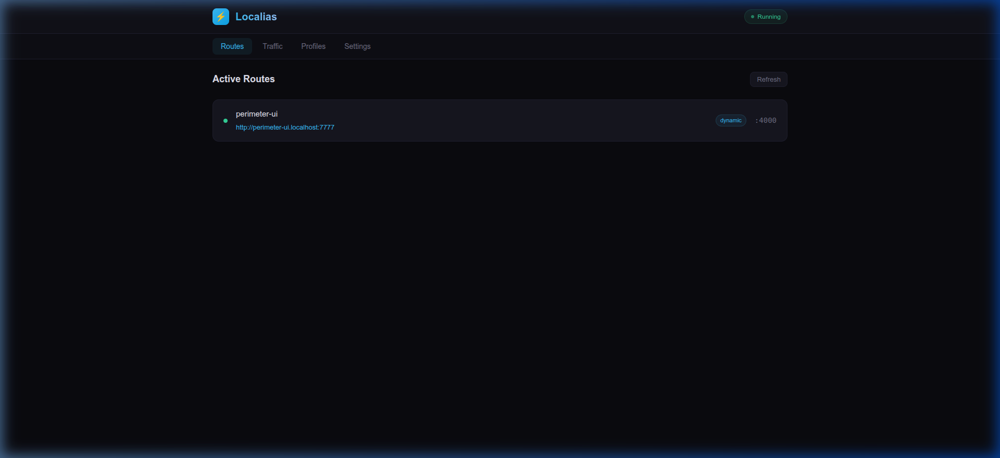
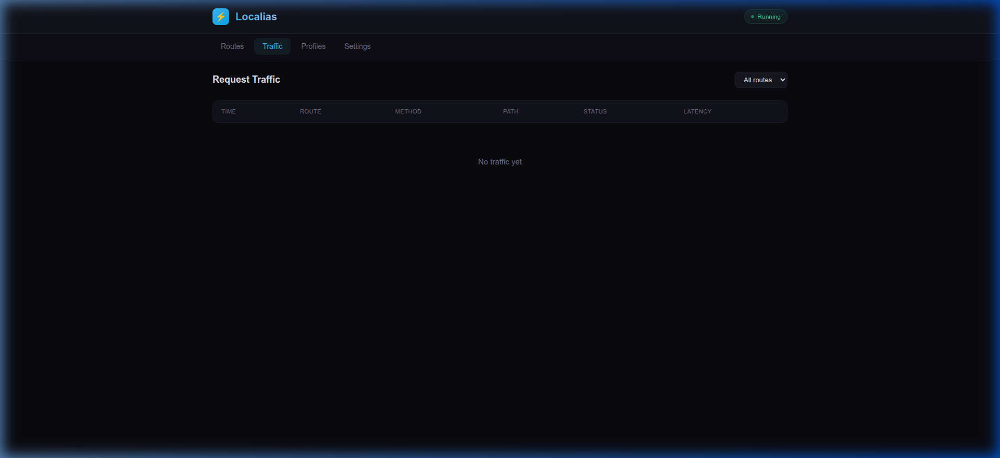
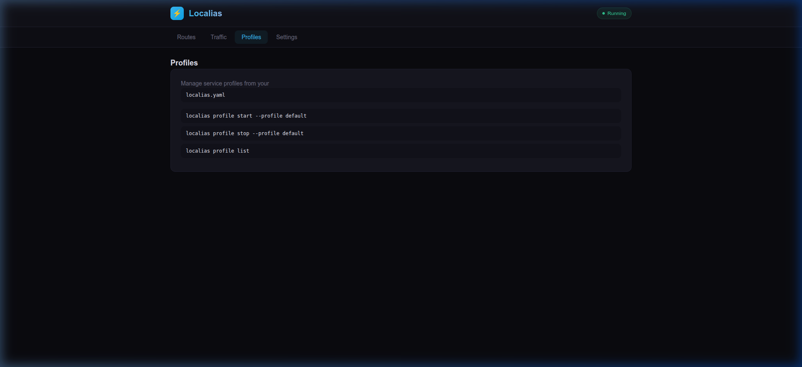
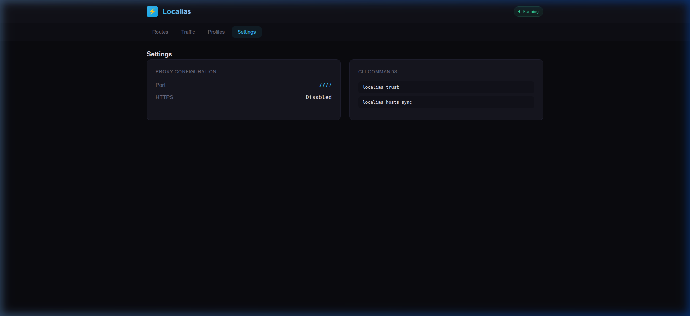

# Localias

**Local reverse proxy — stable `.localhost` URLs for development.**

> Stop memorizing port numbers. Use `http://myapp.localhost:7777` instead of `http://localhost:4231`.

[](https://go.dev)
[](LICENSE)

## Features

- **Reverse Proxy** — Route `name.localhost:7777` → `127.0.0.1:port`
- **WebSocket Support** — HMR for Next.js, Vite, etc. works out of the box
- **HTTPS** — Auto-generated TLS certificates with local CA
- **Dashboard** — Built-in web UI at `localias.localhost:7777`
- **Health Checks** — Background monitoring of all backends
- **Traffic Logging** — Last 1000 requests in a ring buffer
- **Profiles** — Multi-service orchestration via `localias.yaml`
- **MCP Server** — AI agents can discover routes via MCP protocol
- **LAN Sharing** — Share with teammates via mDNS
- **Smart Detection** — Auto-infers project name from package.json, go.mod, or git

## Dashboard

The built-in dashboard at `http://localias.localhost:7777` gives you a real-time view of your local services.

### Routes — see all registered services at a glance


### Traffic — live request log with method, status, and latency


### Profiles — manage multi-service profiles


### Settings — proxy configuration and CLI references


## Installation

### From GitHub Releases (recommended)

```bash
curl -fsSL https://raw.githubusercontent.com/thirukguru/localias/main/install.sh | bash
```

### From Source

```bash
go install github.com/thirukguru/localias@latest
```

### Build from source

```bash
git clone https://github.com/thirukguru/localias.git
cd localias
make build
sudo make install
```

## Quick Start

```bash
# Run your dev server with a named URL
localias run -- npm run dev
# → http://myapp.localhost:7777

# Create a static alias for Docker/external services
localias alias redis 6379
localias alias postgres 5432

# List all routes
localias list

# Open the dashboard
localias dashboard
```

## Commands

| Command | Description |
|---------|-------------|
| `localias run <cmd>` | Run a command with a named `.localhost` URL |
| `localias alias <name> <port>` | Create a static route alias |
| `localias alias --remove <name>` | Remove a static alias |
| `localias list [--json]` | List all active routes |
| `localias proxy start [--https]` | Start the proxy daemon |
| `localias proxy stop` | Stop the proxy daemon |
| `localias trust` | Add CA to system trust store |
| `localias hosts sync` | Write routes to `/etc/hosts` |
| `localias hosts clean` | Remove localias entries from `/etc/hosts` |
| `localias profile start` | Start services from `localias.yaml` |
| `localias profile list` | List available profiles |
| `localias dashboard` | Open web dashboard in browser |
| `localias tunnel <name>` | Expose via tunnel (coming soon) |

## Profiles (`localias.yaml`)

```yaml
profiles:
  default:
    services:
      - name: web
        cmd: "pnpm dev"
        dir: ./apps/web
      - name: api
        cmd: "go run ./api"
        dir: ./apps/api
```

```bash
localias profile start --profile default
```

## Environment Variables

| Variable | Description | Default |
|----------|-------------|---------|
| `LOCALIAS_PORT` | Proxy port | `7777` |
| `LOCALIAS_STATE_DIR` | State directory | `~/.localias` |
| `LOCALIAS_HTTPS` | Enable HTTPS | `0` |
| `LOCALIAS_APP_PORT` | Fixed app port | auto |
| `LOCALIAS_SYNC_HOSTS` | Auto-sync `/etc/hosts` | `0` |
| `LOCALIAS=0` | Disable localias | enabled |

## MCP (AI Agent Integration)

Localias exposes an MCP server for AI agents (Cursor, Claude Desktop, etc.) to discover local services.

**Authentication:** Bearer token, auto-generated on first run.

```bash
# View your token
cat ~/.localias/mcp-token
```

**MCP config for Cursor / Claude Desktop:**
```json
{
  "mcpServers": {
    "localias": {
      "url": "http://localias.localhost:7777/mcp",
      "headers": {
        "Authorization": "Bearer <paste token from ~/.localias/mcp-token>"
      }
    }
  }
}
```

**Available tools:** `list_routes`, `get_route`, `register_route`, `health_check`

## Architecture

```
CLI ──→ Unix Socket (JSON-RPC 2.0) ──→ Daemon
                                         │
                                    Reverse Proxy (HTTP/1.1 + HTTP/2)
                                         │
                                    Route Table ──→ Backend :port
```

## Author

**Thiru K** — [github.com/thirukguru](https://github.com/thirukguru)

## License

MIT
